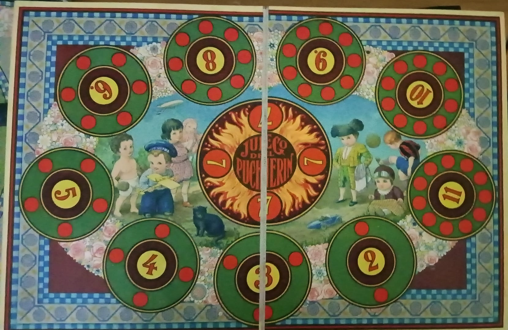

# Pucherin

- [Pucherin](#pucherin)
  - [Play the game](#play-the-game)
  - [Reglas](#reglas)

## Play the game

The game is deployed using github pages and can be played [through here](https://pan-narrans.github.io/Pucherin/).

## Reglas

- Se Inicia partida nueva para entre 1 y 5 jugadores.
- Se reparten 50 fichas entre todos los jugadores
- Cada jugador tira en su turno dos dados de 6 caras en cada turno
- Si sacas un 7, se añade una ficha al puchero
- Si sacas un 12, te llevas el contenido del puchero

- Se añade una ficha a la casilla, si está casilla se completa, te las llevas todas.

- Si los jugadores no tienen más fichas que poner, se llevan las fichas que queden en la casilla
- Si los jugadores no tienen más fichas que poner y saca un 12, se lleva todas las fichas del tablero, incluido el puchero.

- El juego finaliza cuando todos los jugadores han puesto sus fichas y no quedan fichas en el tablero
- Gana el jugador con más fichas
